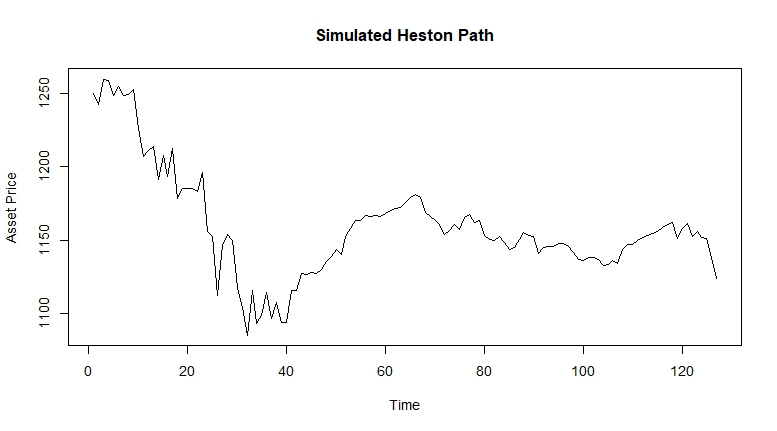

# Heston Monte Carlo Option Pricing

An R-based Monte Carlo simulation project using the **Heston stochastic volatility model** to simulate asset price paths and price derivative contracts.

This project demonstrates stochastic modelling, Monte Carlo simulation, correlated Brownian motion, option pricing, and comparison against Black-Scholes style benchmark methods.

## Project Overview

The Heston model extends the Black-Scholes framework by allowing volatility itself to evolve randomly over time. This makes it more realistic for financial markets, where volatility is not constant.

This project simulates asset paths under stochastic volatility and applies Monte Carlo methods to estimate option values.

## Project Context

This project was completed as part of a university group assignment in stochastic processes / financial mathematics. The repository has been cleaned and reorganised for portfolio use.

The code and outputs are presented as a learning and portfolio project based on the group assignment. Individual contributions are not separated in the original files, so this repository focuses on the modelling approach, simulation structure, and financial mathematics demonstrated by the project.

## Objectives

- Simulate asset price paths using the Heston stochastic volatility model.
- Model stochastic variance using mean reversion, volatility of volatility, and correlation between asset and variance shocks.
- Price option contracts using Monte Carlo simulation.
- Estimate standard errors for simulated prices.
- Compare stochastic-volatility results against simpler benchmark pricing methods.

## Model Summary

The Heston model uses two coupled stochastic processes:

```math
dS_t = \mu S_t dt + \sqrt{v_t} S_t dW_t^S
```

```math
dv_t = \kappa(\theta - v_t)dt + \sigma\sqrt{v_t} dW_t^v
```

where:

- `S_t` is the asset price
- `v_t` is the variance process
- `mu` is the drift
- `kappa` controls mean reversion speed
- `theta` is the long-run variance
- `sigma` is volatility of volatility
- `W_t^S` and `W_t^v` are correlated Brownian motions

## Repository Structure

```text
heston-monte-carlo-option-pricing/
├── src/
│   ├── heston_monte_carlo_pricing.R
│   ├── heston_simulation.R
│   └── black_scholes_pricing.R
├── outputs/
│   └── simulated_heston_path.jpeg
├── docs/
├── README.md
├── .gitignore
└── LICENSE
```

## Key Features

- Heston stochastic volatility path simulation
- Monte Carlo pricing for derivative contracts
- Correlated Brownian motion generation
- Standard error estimation
- Black-Scholes benchmark comparison
- Visualisation of simulated stochastic-volatility asset paths

## Example Output

### Simulated Heston Asset Path



## Skills Demonstrated

- R programming
- Monte Carlo simulation
- Stochastic differential equations
- Stochastic volatility modelling
- Option pricing
- Brownian motion and correlated shocks
- Numerical simulation
- Financial mathematics
- Quantitative finance modelling

## Limitations

This is a compact educational implementation. It does not include:

- Market calibration to option chains
- Implied volatility surface fitting
- Greeks estimation
- Variance reduction techniques
- Production-grade risk system design

## Future Work

Possible extensions include:

- Calibrating Heston parameters to real option market data
- Adding Greeks using finite differences or pathwise estimators
- Adding variance reduction methods
- Comparing Monte Carlo prices against closed-form Heston prices
- Extending the model to price exotic options
- Rewriting the project in Python for wider quant-finance tooling support

## License

This project is licensed under the MIT License.
